# Sky130 ASIC Characterization and Yield Prediction Framework

This project presents a Sky130 ASIC characterization and yield prediction framework using RTL design, LibreLane/OpenLane physical implementation, STA corner analysis, SPICE-based ring oscillator characterization, post-layout extracted simulation, and delay-chain verification.

The goal is to study how a Sky130 ASIC behaves across process, voltage, and temperature conditions and to classify the design into slow, typical, and fast operating behavior. The project also estimates pass/fail yield using available timing and simulation data.

This project does **not** claim measured silicon yield. The results are based on Sky130 STA, layout, and SPICE simulation.

---

## Project Goal

The main goal of this project is to build a complete ASIC characterization workflow using the Sky130 open-source PDK.

The project focuses on:

- RTL design and verification
- Sky130 physical implementation
- DRC and LVS verification
- Static timing analysis across PVT conditions
- Physical ring oscillator SPICE characterization
- Post-layout extracted ring oscillator simulation
- Physical delay-chain verification
- Pass/fail corner classification
- Simulation/STA-based yield prediction

---

## Project Folder Structure

```text
Sky130-Characterization-Yield-Prediction/
├── final_deliverables/
│   ├── rtl/
│   ├── openlane_config/
│   ├── spice/
│   ├── reports/
│   ├── plots/
│   ├── docs/
│   ├── screenshots/
│   └── demo/
├── README.md
└── .gitignore
```

| Folder | Purpose |
|---|---|
| `rtl/` | Verilog RTL source files |
| `openlane_config/` | OpenLane/LibreLane design configuration files |
| `spice/` | RO and delay-chain SPICE simulation files |
| `reports/` | STA, physical verification, RO, and delay-chain summary reports |
| `plots/` | Final characterization and yield plots |
| `docs/` | Final report and cleaned project PDF |
| `screenshots/` | Layout, waveform, timing, DRC/LVS, and proof screenshots |
| `demo/` | Demo checklist, demo script, key screenshots, key plots, and final outputs |

---

## Architecture Overview

The project is based on a characterization-style ASIC design. The design includes RTL blocks and physical test structures that help evaluate timing, process behavior, and circuit performance.

| Block | Purpose |
|---|---|
| Ring Oscillator Counter | Counts RO activity and helps classify process speed |
| Delay Chain | Measures propagation delay through a physical delay path |
| PVT Monitor Logic | Classifies slow, typical, and fast behavior |
| Clock / Timing Monitor | Checks timing-related behavior |
| Status / Register Logic | Stores pass/fail and classification results |
| Physical RO Structure | Real standard-cell ring oscillator used for SPICE characterization |
| Physical Delay Chain | Real delay-chain structure used for post-layout delay measurement |

### Characterization Workflow

```text
RTL Design
   ↓
RTL Simulation
   ↓
OpenLane / LibreLane Physical Implementation
   ↓
DRC / LVS / STA Verification
   ↓
Physical RO SPICE Simulation
   ↓
Post-layout Extracted RO Simulation
   ↓
Delay-chain Characterization
   ↓
PVT Corner Sweeps
   ↓
Pass/Fail Classification
   ↓
Yield Prediction
```

---

## Tools Used

| Tool | Purpose |
|---|---|
| Verilog / SystemVerilog | RTL design |
| Vivado | RTL simulation and waveform checking |
| LibreLane / OpenLane | ASIC physical design flow |
| OpenROAD | Placement, routing, and physical implementation |
| OpenSTA | Static timing analysis |
| Magic | Layout viewing, extraction, and DRC |
| Netgen | LVS verification |
| KLayout | Final layout viewing |
| ngspice | SPICE simulation |
| Sky130 PDK | Open-source 130 nm process design kit |
| Python / Matplotlib | Plot generation and result visualization |

---

## RTL Design

The RTL design was created to support characterization and pass/fail classification.

The main RTL tasks include:

- Implementing ring oscillator counter logic
- Implementing delay-chain measurement support
- Defining pass/fail status signals
- Creating warning/fault classification logic
- Running RTL simulations before physical implementation

The RTL was used as the digital base for the Sky130 physical implementation flow.

---

## Physical Implementation

The design was physically implemented using LibreLane/OpenLane with the Sky130 PDK.

The physical implementation flow included:

- Synthesis
- Floorplanning
- Placement
- Clock tree synthesis
- Routing
- Final GDS generation
- DRC verification
- LVS verification
- STA timing verification

| Check | Result |
|---|---|
| Full-chip layout generated | Completed |
| DRC | Passed |
| LVS | Passed |
| Timing | Passed for main TT/SS/FF cases |
| Final GDS/layout evidence | Completed |

### Full-Chip Layout

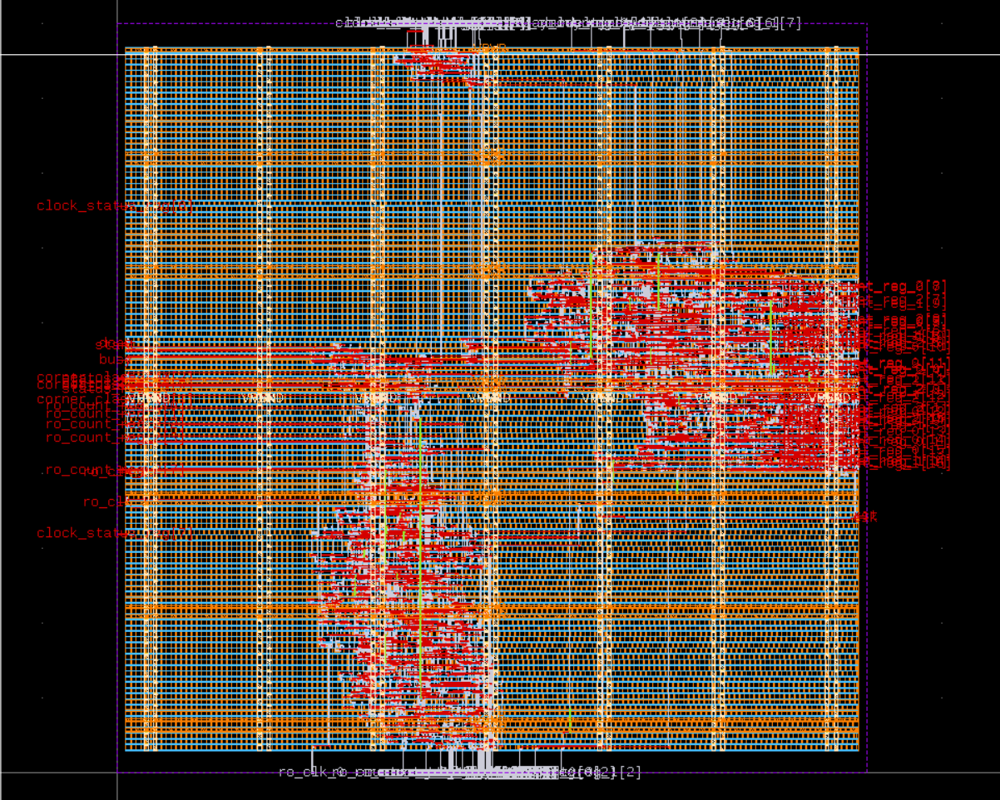

---

## Ring Oscillator Characterization

A physical Sky130 standard-cell ring oscillator was implemented and simulated using SPICE. This was done to compare slow, typical, and fast process behavior.

The old simulated input-clock RO counter data was removed from the final results. The final project uses physical RO SPICE results instead.

| Corner | Voltage | Temperature | RO Type | Period | Frequency | Classification |
|---|---:|---:|---|---:|---:|---|
| SS | 1.60 V | 100°C | Pre-layout Sky130 SPICE | 481.9 ps | 2.075 GHz | Slow |
| TT | 1.80 V | 27°C | Pre-layout Sky130 SPICE | 245.5 ps | 4.073 GHz | Typical |
| TT | 1.80 V | 27°C | Post-layout extracted SPICE | 505.69 ps | 1.9768 GHz | Typical |
| FF | 1.95 V | -40°C | Pre-layout Sky130 SPICE | 156.7 ps | 6.380 GHz | Fast |

### RO Layout

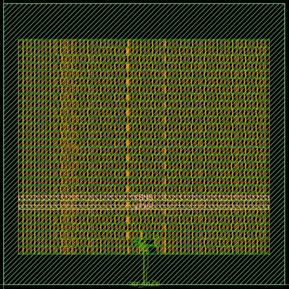

### TT RO SPICE Waveform

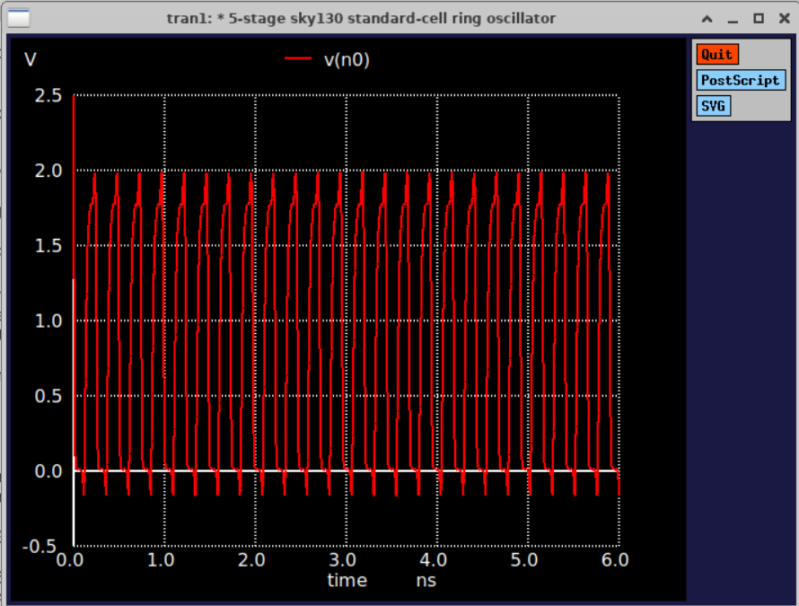

### TT Post-layout Extracted RO Waveform

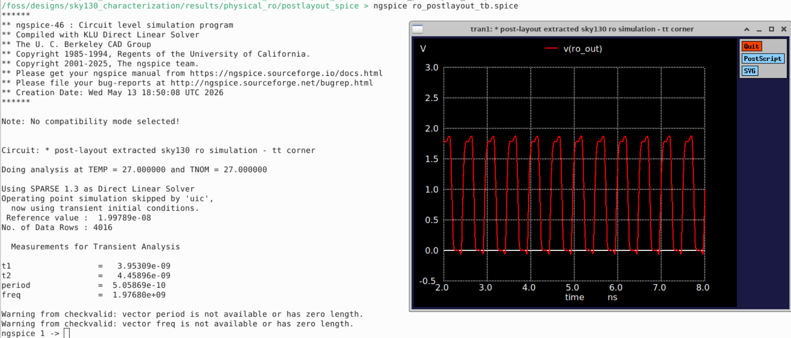

---

## Delay-Chain Characterization

A physical delay-chain layout was created and verified. The delay chain was simulated using post-layout extracted SPICE at the TT corner.

| Corner | Voltage | Temperature | Rise Delay | Fall Delay | Status |
|---|---:|---:|---:|---:|---|
| TT | 1.80 V | 27°C | 988.95 ps | 1.21034 ns | Pass |

### Delay-Chain Layout

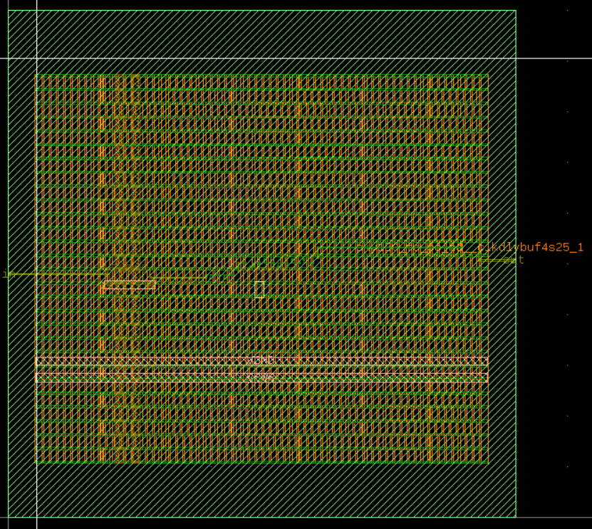

### Delay-Chain SPICE Waveform


---

## STA Corner Sweeps

Static timing analysis was performed across available Sky130 process, voltage, and temperature conditions.

The available process corners used in this project were:

- TT
- SS
- FF

FS and SF corners were not available in the installed Sky130 Liberty files, so they were not included.

---

## Process Corner Results

| Corner | Setup Slack | Hold Slack | WNS | TNS | Status |
|---|---:|---:|---:|---:|---|
| TT | 6.17 ns | 0.23 ns | 0.00 | 0.00 | Pass |
| SS | 4.02 ns | 0.72 ns | 0.00 | 0.00 | Pass |
| FF | 6.80 ns | 0.05 ns | 0.00 | 0.00 | Pass |

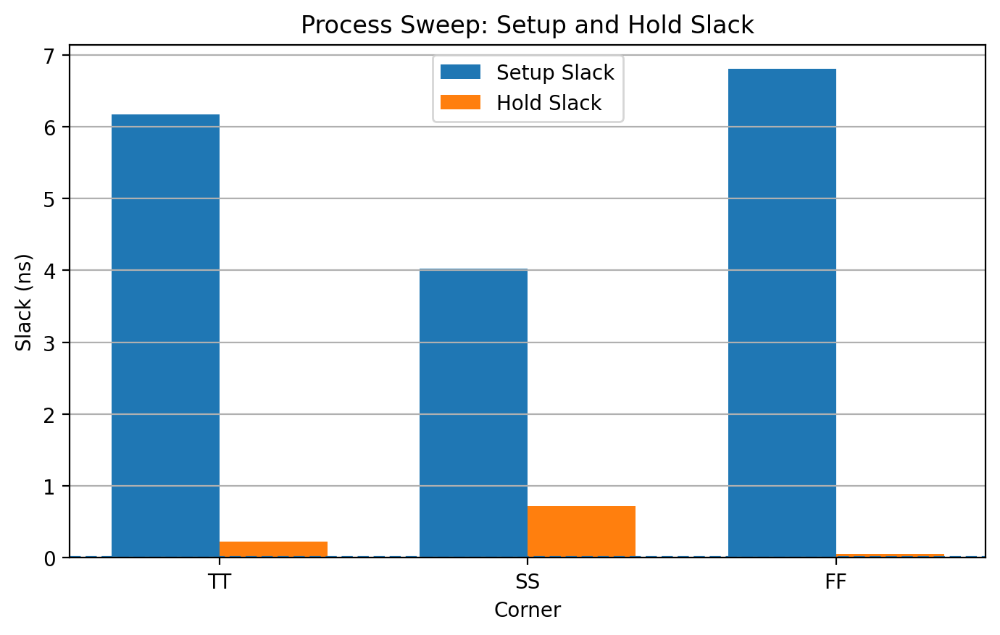

---

## SS Voltage Sweep Results

The SS corner was tested across multiple voltages at -40°C. Low-voltage SS cases failed timing, while higher-voltage cases passed.

| Corner | Voltage | Temperature | Setup Slack | Hold Slack | WNS | TNS | Status |
|---|---:|---:|---:|---:|---:|---:|---|
| SS | 1.28 V | -40°C | -13.24 ns | -1.42 ns | -13.24 | -1235.32 | Fail |
| SS | 1.35 V | -40°C | -5.62 ns | -0.49 ns | -5.62 | -214.25 | Fail |
| SS | 1.40 V | -40°C | -2.39 ns | -0.08 ns | -2.39 | -44.41 | Fail |
| SS | 1.44 V | -40°C | -0.57 ns | 0.16 ns | -0.57 | -4.74 | Fail |
| SS | 1.60 V | -40°C | 3.27 ns | 0.72 ns | 0.00 | 0.00 | Pass |
| SS | 1.76 V | -40°C | 5.15 ns | 0.47 ns | 0.00 | 0.00 | Pass |

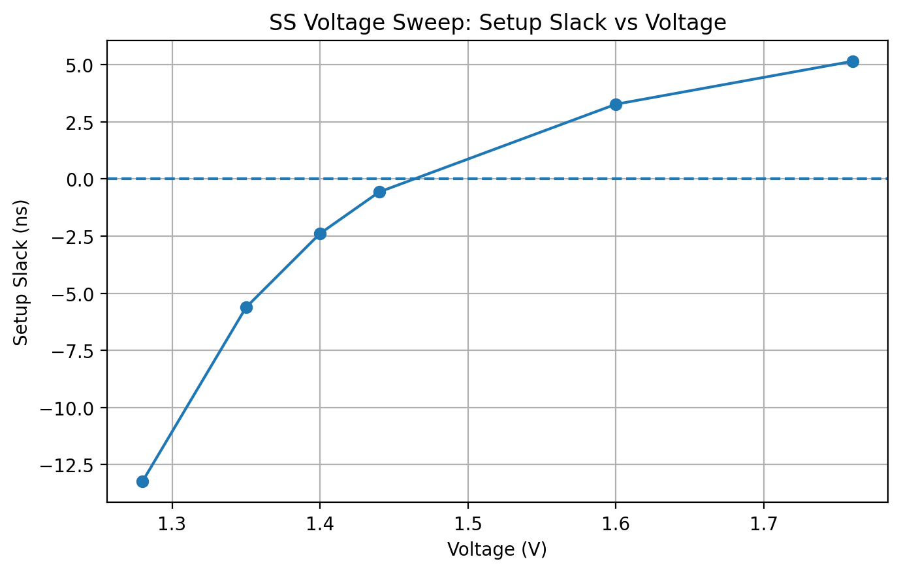

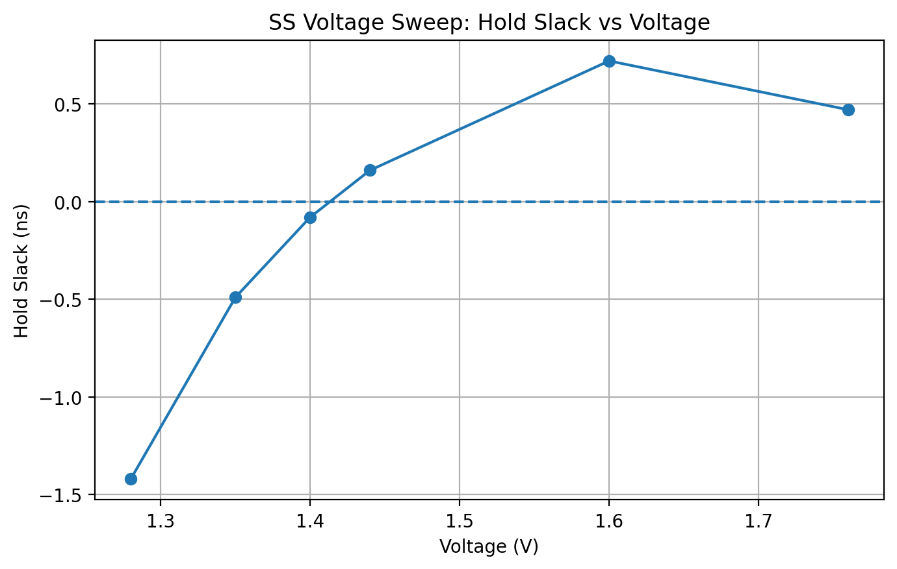

---

## FF Voltage Sweep Results

The FF corner passed across the tested voltage range. FF had strong setup slack but tighter hold slack.

| Corner | Voltage | Temperature | Setup Slack | Hold Slack | WNS | TNS | Status |
|---|---:|---:|---:|---:|---:|---:|---|
| FF | 1.56 V | -40°C | 6.18 ns | 0.19 ns | 0.00 | 0.00 | Pass |
| FF | 1.65 V | -40°C | 6.41 ns | 0.15 ns | 0.00 | 0.00 | Pass |
| FF | 1.76 V | -40°C | 6.59 ns | 0.10 ns | 0.00 | 0.00 | Pass |
| FF | 1.95 V | -40°C | 6.80 ns | 0.05 ns | 0.00 | 0.00 | Pass |

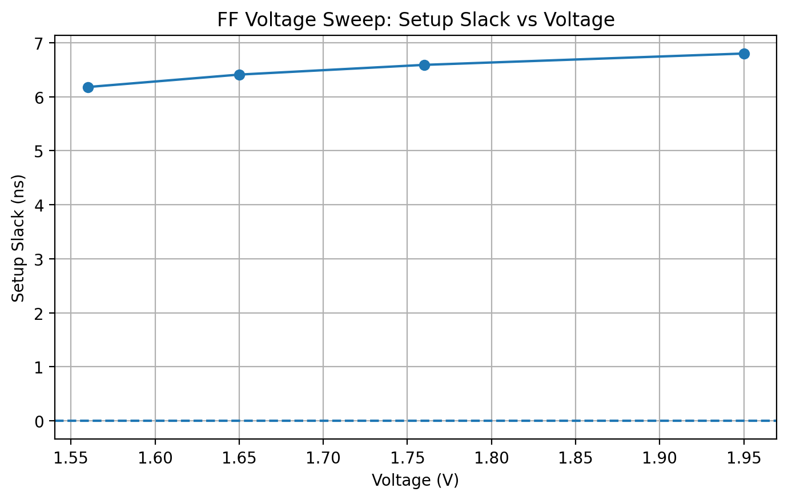

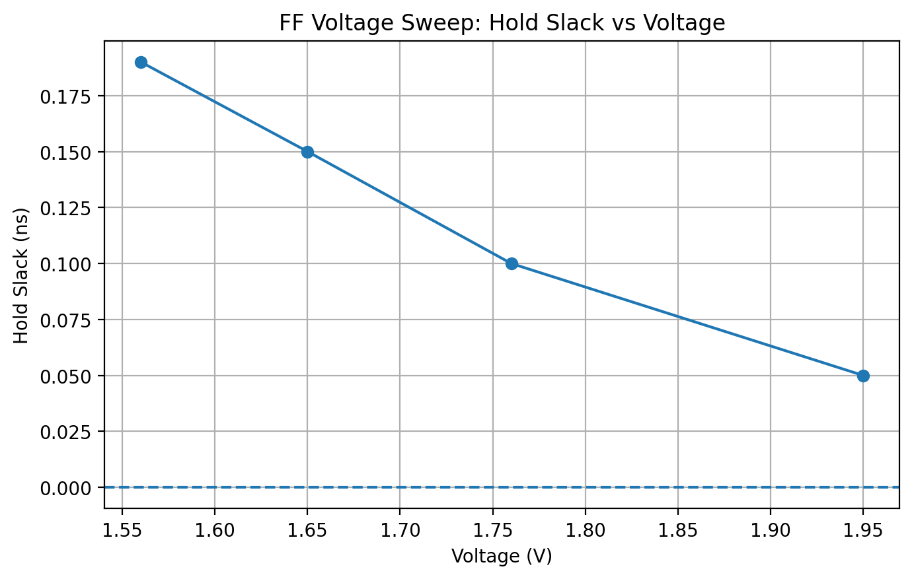

---

## Temperature Sweep Results

Temperature sweeps were performed for TT, SS, and FF conditions.

| Corner | Voltage | Temperature | Setup Slack | Hold Slack | Status |
|---|---:|---:|---:|---:|---|
| TT | 1.80 V | 25°C | 6.17 ns | 0.23 ns | Pass |
| TT | 1.80 V | 100°C | 6.15 ns | 0.24 ns | Pass |
| SS | 1.60 V | -40°C | 3.27 ns | 0.72 ns | Pass |
| SS | 1.60 V | 100°C | 4.02 ns | 0.72 ns | Pass |
| FF | 1.95 V | -40°C | 6.80 ns | 0.05 ns | Pass |
| FF | 1.95 V | 100°C | 6.76 ns | 0.07 ns | Pass |

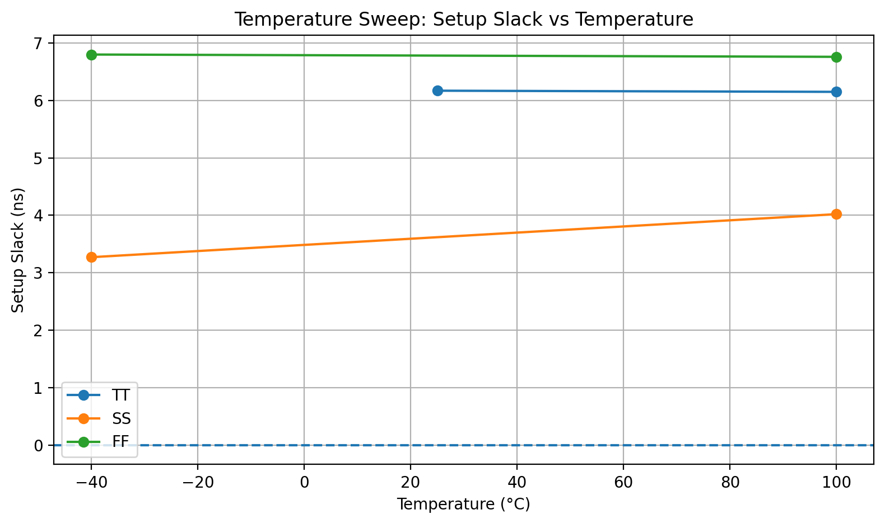

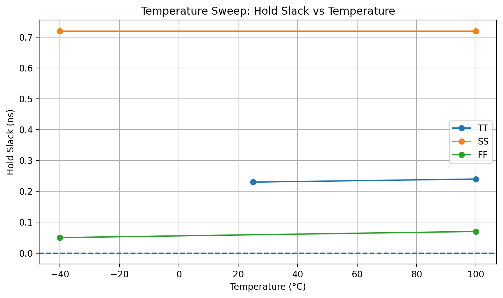

---

## Final Characterization Table

| Corner | Voltage | Temperature | Physical RO Frequency | Delay Result | Setup Slack | Hold Slack | PVT Status | Classification | Pass/Fail |
|---|---:|---:|---|---|---:|---:|---|---|---|
| SS | 1.60 V | 100°C | 2.075 GHz | Slow behavior expected / STA-based | 4.02 ns | 0.72 ns | Slow | Slow | Pass |
| TT | 1.80 V | 27°C | 1.9768 GHz post-layout extracted | Rise 988.95 ps, Fall 1.21034 ns | 6.17 ns | 0.23 ns | Normal | Typical | Pass |
| FF | 1.95 V | -40°C | 6.380 GHz | Fast behavior expected / STA-based | 6.80 ns | 0.05 ns | Fast | Fast | Pass |

---

## Yield Prediction

The yield prediction is based on simulation and STA pass/fail data. It is not measured silicon yield.

| Metric | Pass Condition | Fail Condition |
|---|---|---|
| Setup slack | Setup slack > 0 ns | Setup slack < 0 ns |
| Hold slack | Hold slack > 0 ns | Hold slack < 0 ns |
| WNS | WNS ≥ 0 | WNS < 0 |
| TNS | TNS = 0 | TNS < 0 |
| DRC | 0 violations | Any DRC violation |
| LVS | Circuits match uniquely | LVS mismatch |
| RO SPICE | Oscillation observed and frequency measured | No oscillation or invalid frequency |
| Delay-chain SPICE | Rise/fall delay measured | Delay measurement failed |

| Category | Passing Cases | Total Cases | Estimated Pass Rate |
|---|---:|---:|---:|
| Overall STA sweep | 15 | 19 | 78.9% |
| Physical RO SPICE sweep | 3 | 3 | 100.0% |
| Post-layout extracted RO | 1 | 1 | 100.0% |
| Physical delay-chain SPICE | 2 | 2 | 100.0% |
| Physical verification | 4 | 4 | 100.0% |

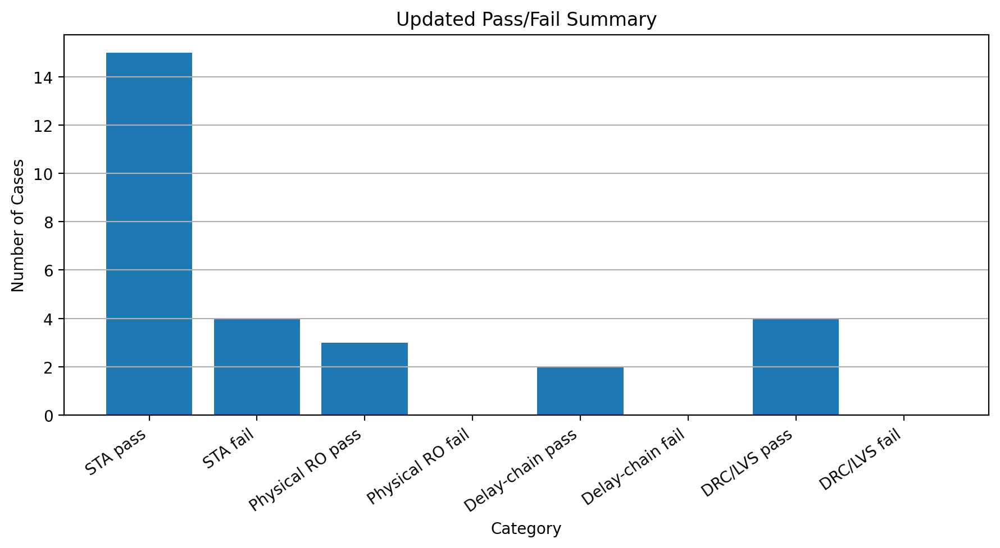

---

## Key Results

| Observation | Result |
|---|---|
| SS behavior | Slowest process behavior |
| TT behavior | Nominal baseline |
| FF behavior | Fastest process behavior |
| Low-voltage SS cases | Failed timing |
| Higher voltage | Improved setup slack |
| FF hold slack | Tightest hold slack |
| Physical RO trend | SS < TT < FF frequency |
| TT post-layout RO | Slower than pre-layout due to extracted parasitics |
| Delay-chain TT result | Rise and fall delay successfully measured |
| Yield estimate | STA sweep pass rate = 78.9% |

---

## Limitations

| Limitation | Explanation |
|---|---|
| No measured silicon data | Results are from simulation, STA, layout, and SPICE |
| Not full silicon yield | Yield is estimated from available pass/fail data |
| Limited extracted RO simulation | Post-layout extracted RO simulation was completed for TT only |
| SS/FF extracted RO future work | SS and FF extracted post-layout RO simulations remain future work |
| Limited delay-chain extracted simulation | Delay-chain extracted SPICE was completed for TT only |
| No full Monte Carlo sweep | Monte Carlo analysis would improve yield prediction accuracy |
| Fabrication required | True silicon validation requires tapeout and measured chip data |

---

## Future Work

Future improvements include:

- Complete SS and FF post-layout extracted RO simulations
- Run full Monte Carlo simulations
- Add more delay-chain structures
- Add more process classification logic
- Automate the full characterization script flow
- Tape out the design
- Measure real silicon RO frequency and delay-chain data
- Compare silicon-measured data with simulation results

---

## Demo Material

The `demo/` folder contains a lightweight package for presenting the project.

| Demo File/Folder | Purpose |
|---|---|
| `demo_checklist.md` | Checklist of what to show during the demo |
| `demo_script.md` | Short speaking script for the demo |
| `key_screenshots/` | Important layout and waveform screenshots |
| `key_plots/` | Important final plots |
| `final_outputs/` | Final PDF and output files |

---

## Final Deliverables

| Deliverable | Status |
|---|---|
| RTL source files | Completed |
| OpenLane/LibreLane configuration | Completed |
| Physical implementation | Completed |
| DRC/LVS verification | Completed |
| STA timing analysis | Completed |
| Physical RO SPICE simulation | Completed |
| TT post-layout extracted RO simulation | Completed |
| Physical delay-chain verification | Completed |
| PVT sweep plots | Completed |
| Yield prediction table | Completed |
| Final report/PDF | Completed |
| Demo package | Completed |

---

## Project Summary

This project successfully demonstrates a complete Sky130 ASIC characterization workflow. The design was implemented using RTL, physically realized through LibreLane/OpenLane, verified using DRC/LVS/timing checks, and characterized using SPICE and STA-based sweep results.

The final results show expected Sky130 behavior:

- SS behaves as the slow corner.
- TT behaves as the nominal corner.
- FF behaves as the fast corner.
- Low-voltage SS cases fail timing.
- Higher voltage improves setup slack.
- FF gives strong setup slack but tighter hold slack.
- The TT post-layout extracted RO frequency is lower than pre-layout due to parasitic effects.
- The final STA-based estimated pass rate is 78.9%.

This project is a simulation and open-source physical-design based characterization project. True silicon validation would require fabrication and measured chip data.
